[](https://central.sonatype.com/artifact/io.github.mflisar.composepreferences/core)   
# ComposePreferences
    

This library offers you an easily extendible compose framework for preferences.

> [!NOTE]
> All features are splitted into separate modules, just include the modules you want to use!

# Table of Contents

- [Screenshots](#camera-screenshots)
- [Supported Platforms](#computer-supported-platforms)
- [Versions](#arrow_right-versions)
- [Setup](#wrench-setup)
- [Usage](#rocket-usage)
- [Modules](#file_folder-modules)
- [Demo](#sparkles-demo)
- [More](#information_source-more)
- [API](#books-api)
- [Other Libraries](#bulb-other-libraries)

# :camera: Screenshots

|  |  |  |
|---|---|---|
| 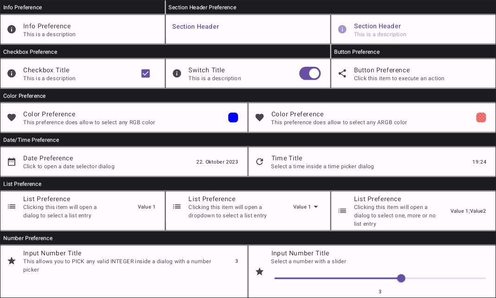 | 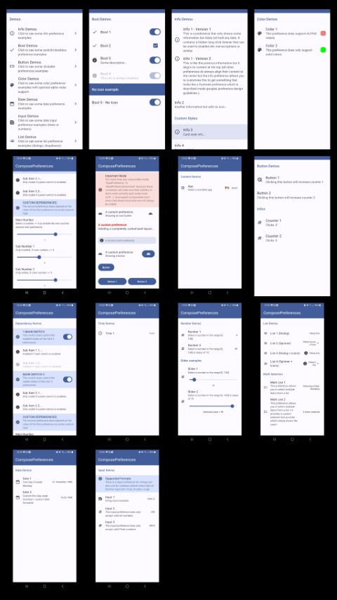 |

### bool

|  |  |  |
|---|---|---|
| 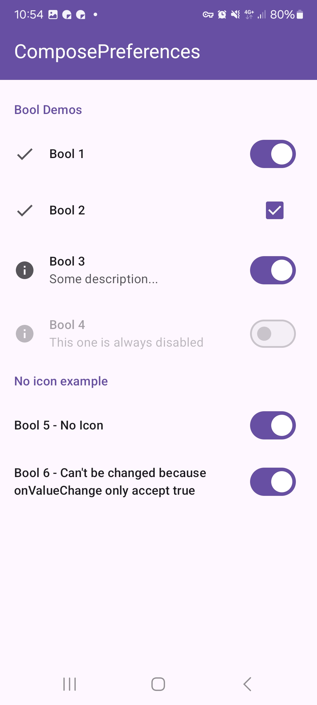 | 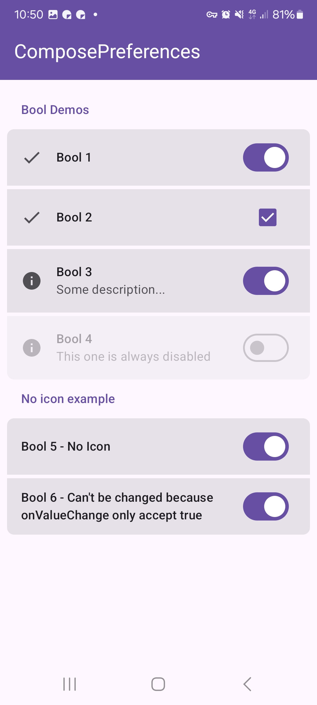 |

### button

|  |  |  |
|---|---|---|
|  |  |

### color

|  |  |  |
|---|---|---|
|  |  |  |
|  |

### core

|  |  |  |
|---|---|---|
| 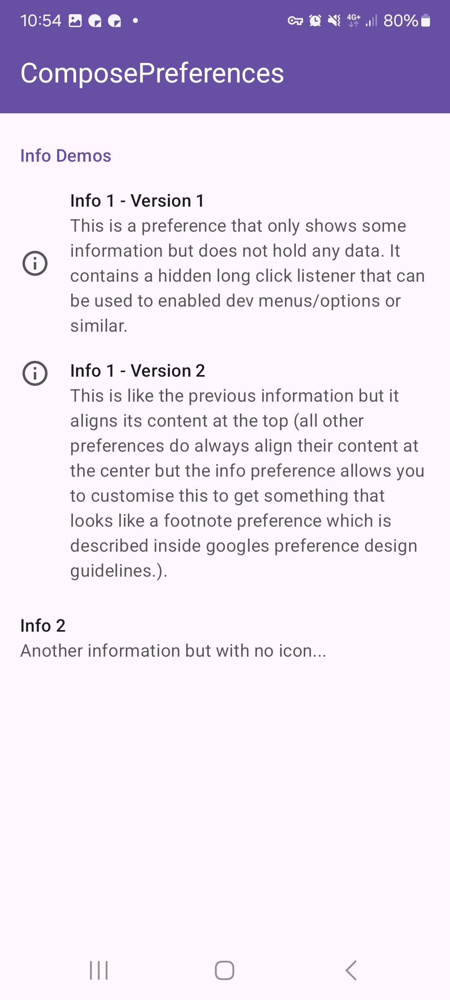 | 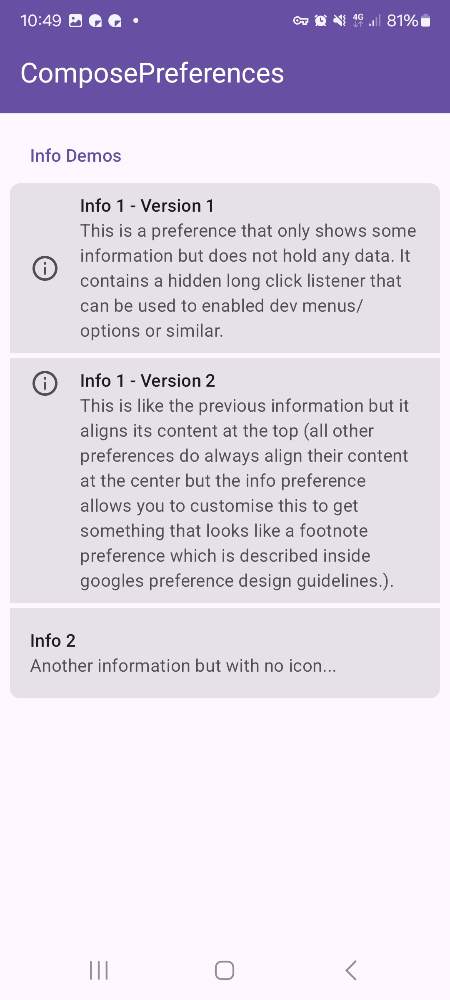 | 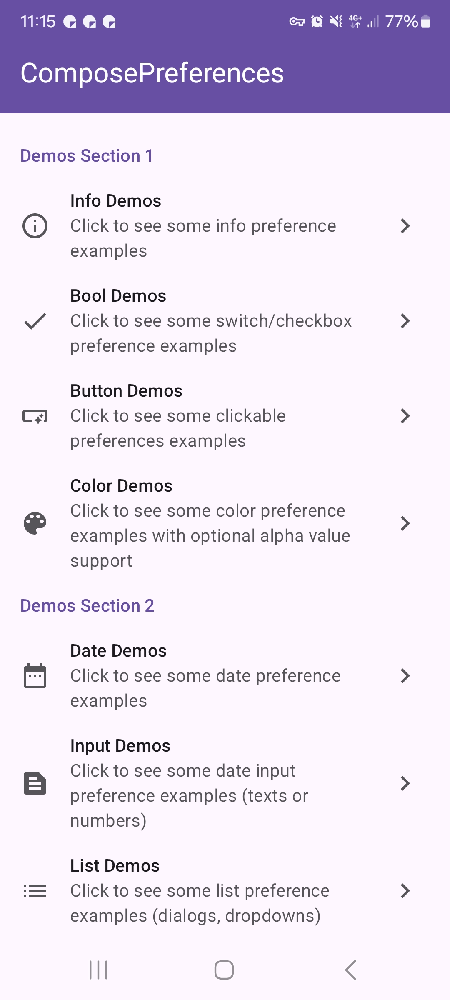 |
| 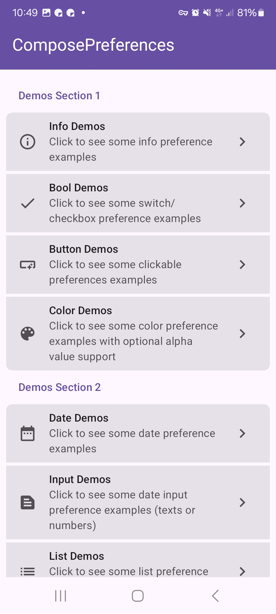 |

### date

|  |  |  |
|---|---|---|
|  |  |  |

### input

|  |  |  |
|---|---|---|
| 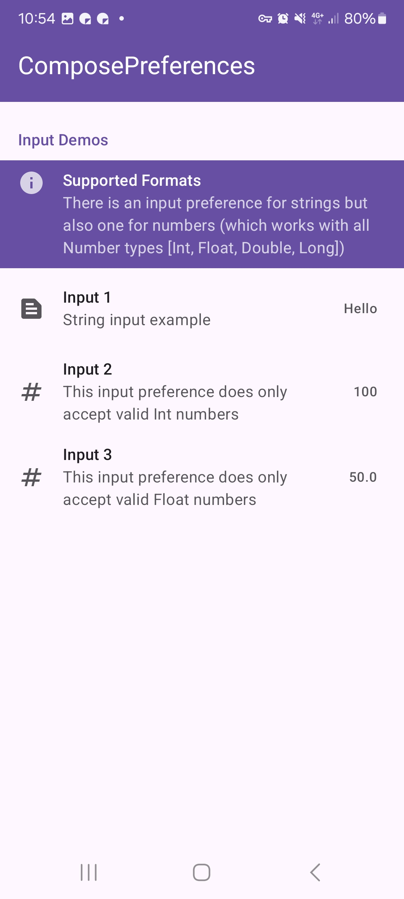 | 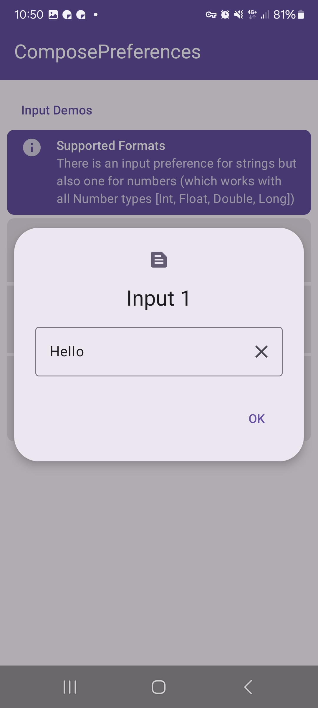 | 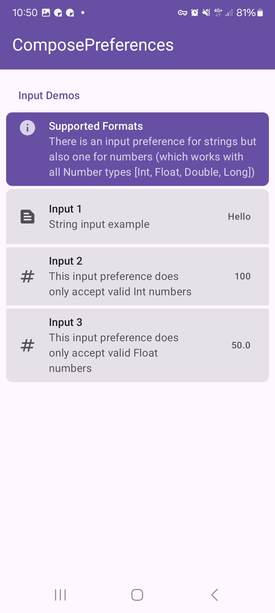 |

### list

|  |  |  |
|---|---|---|
| 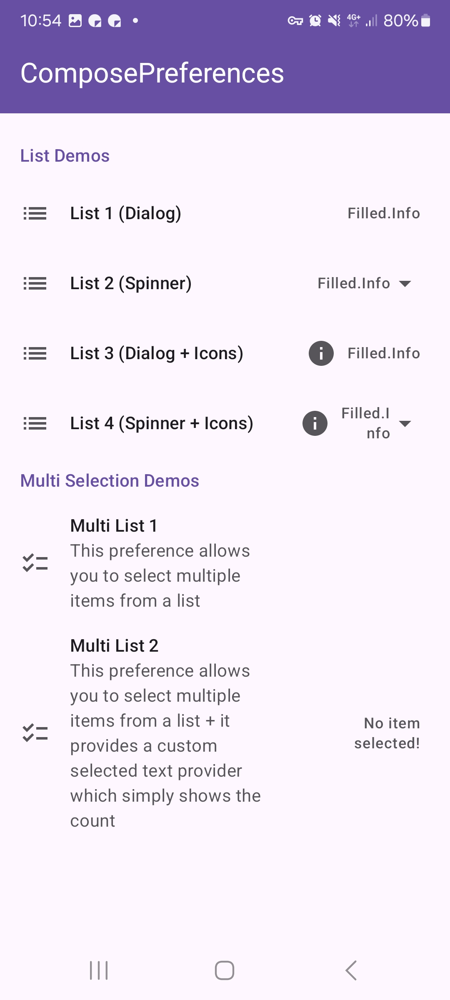 | 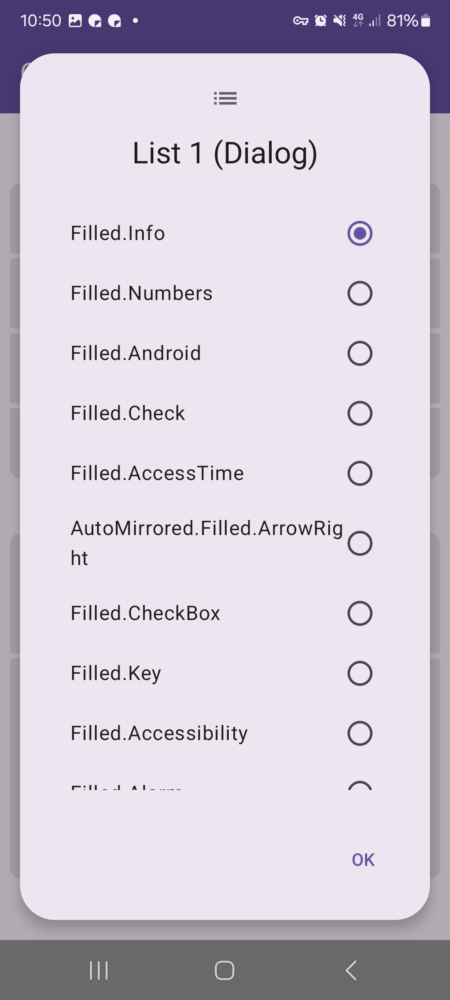 | 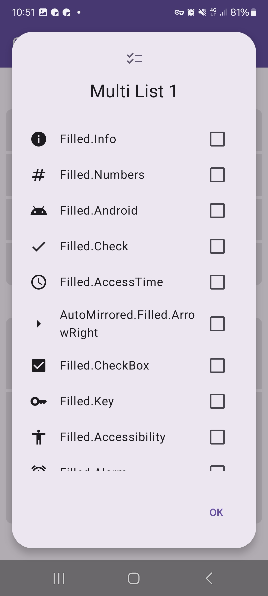 |
| 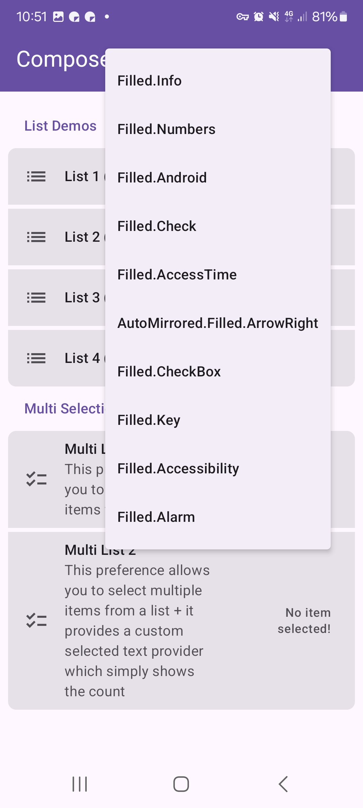 |  |

### number

|  |  |  |
|---|---|---|
| 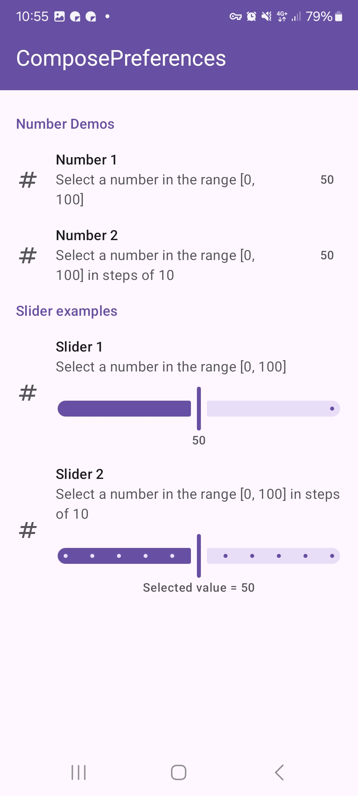 | 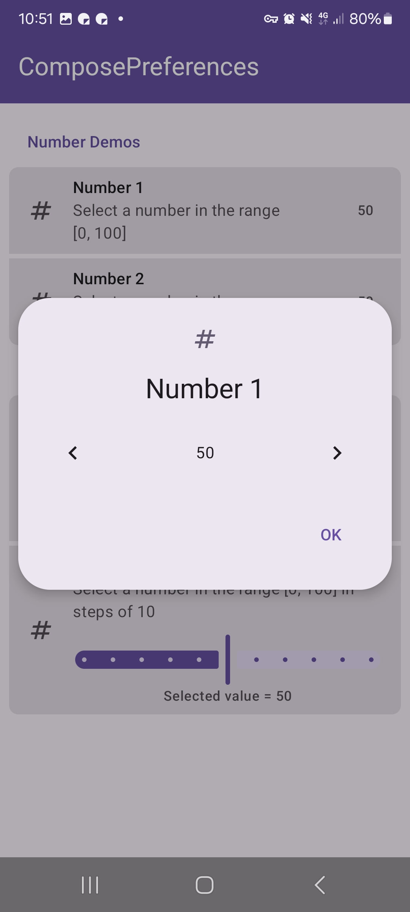 | 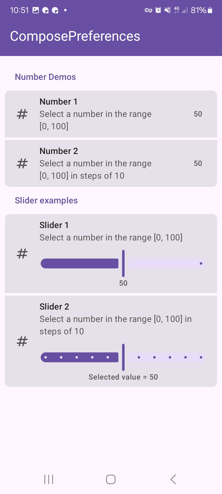 |

### time

|  |  |  |
|---|---|---|
| 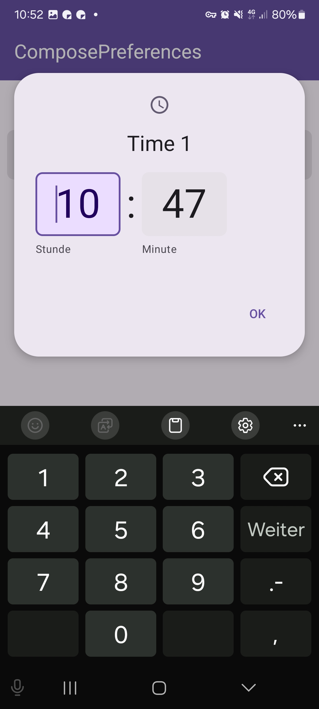 | 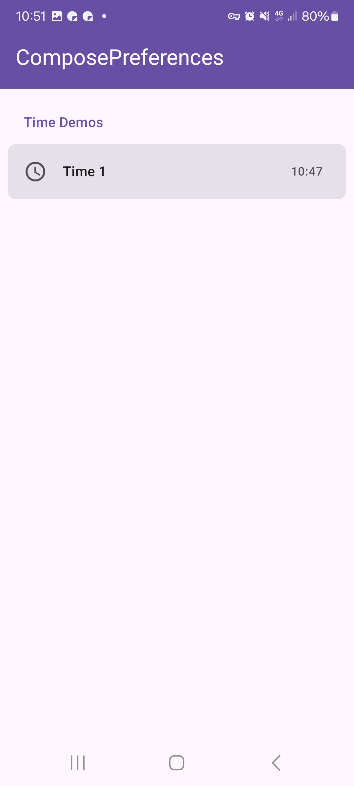 |

# :computer: Supported Platforms

| Module | android | iOS | windows | wasm |
|---|---|---|---|---|
| core | ✅ | ✅ | ✅ | ✅ |
| screen-bool | ✅ | ✅ | ✅ | ✅ |
| screen-button | ✅ | ✅ | ✅ | ✅ |
| screen-color | ✅ | ✅ | ✅ | ✅ |
| screen-date | ✅ | ✅ | ✅ | ✅ |
| screen-input | ✅ | ✅ | ✅ | ✅ |
| screen-list | ✅ | ✅ | ✅ | ✅ |
| screen-number | ✅ | ✅ | ✅ | ✅ |
| screen-time | ✅ | ✅ | ✅ | ✅ |
| kotpreferences | ✅ | ✅ | ✅ | ✅ |

# :arrow_right: Versions

| Dependency | Version |
|---|---|
| Kotlin | `2.3.20` |
| Jetbrains Compose | `1.10.3` |
| Jetbrains Compose Material3 | `1.9.0` |

> :warning: Following experimental annotations are used:
> - **OptIn**
>   - `androidx.compose.ui.ExperimentalComposeUiApi` (1x)
>
> I try to use as less experimental features as possible, but in this case the ones above are needed!

# :wrench: Setup

<details open>

<summary><b>Using Version Catalogs</b></summary>

<br>

Define the dependencies inside your **libs.versions.toml** file.

```toml
[versions]

composepreferences = "<LATEST-VERSION>"

[libraries]

composepreferences-core = { module = "io.github.mflisar.composepreferences:core", version.ref = "composepreferences" }
composepreferences-screen-bool = { module = "io.github.mflisar.composepreferences:screen-bool", version.ref = "composepreferences" }
composepreferences-screen-button = { module = "io.github.mflisar.composepreferences:screen-button", version.ref = "composepreferences" }
composepreferences-screen-color = { module = "io.github.mflisar.composepreferences:screen-color", version.ref = "composepreferences" }
composepreferences-screen-date = { module = "io.github.mflisar.composepreferences:screen-date", version.ref = "composepreferences" }
composepreferences-screen-input = { module = "io.github.mflisar.composepreferences:screen-input", version.ref = "composepreferences" }
composepreferences-screen-list = { module = "io.github.mflisar.composepreferences:screen-list", version.ref = "composepreferences" }
composepreferences-screen-number = { module = "io.github.mflisar.composepreferences:screen-number", version.ref = "composepreferences" }
composepreferences-screen-time = { module = "io.github.mflisar.composepreferences:screen-time", version.ref = "composepreferences" }
composepreferences-kotpreferences = { module = "io.github.mflisar.composepreferences:kotpreferences", version.ref = "composepreferences" }
```

And then use the definitions in your projects **build.gradle.kts** file like following:

```java
implementation(libs.composepreferences.core)
implementation(libs.composepreferences.screen.bool)
implementation(libs.composepreferences.screen.button)
implementation(libs.composepreferences.screen.color)
implementation(libs.composepreferences.screen.date)
implementation(libs.composepreferences.screen.input)
implementation(libs.composepreferences.screen.list)
implementation(libs.composepreferences.screen.number)
implementation(libs.composepreferences.screen.time)
implementation(libs.composepreferences.kotpreferences)
```

</details>

<details>

<summary><b>Direct Dependency Notation</b></summary>

<br>

Simply add the dependencies inside your **build.gradle.kts** file.

```kotlin
val composepreferences = "<LATEST-VERSION>"

implementation("io.github.mflisar.composepreferences:core:${composepreferences}")
implementation("io.github.mflisar.composepreferences:screen-bool:${composepreferences}")
implementation("io.github.mflisar.composepreferences:screen-button:${composepreferences}")
implementation("io.github.mflisar.composepreferences:screen-color:${composepreferences}")
implementation("io.github.mflisar.composepreferences:screen-date:${composepreferences}")
implementation("io.github.mflisar.composepreferences:screen-input:${composepreferences}")
implementation("io.github.mflisar.composepreferences:screen-list:${composepreferences}")
implementation("io.github.mflisar.composepreferences:screen-number:${composepreferences}")
implementation("io.github.mflisar.composepreferences:screen-time:${composepreferences}")
implementation("io.github.mflisar.composepreferences:kotpreferences:${composepreferences}")
```

</details>

# :rocket: Usage

#### Basic example

```kotlin
// select a style for your preferences
val style = DefaultStyle.create()
val modernStyle = ModernStyle.create()

// create a preference settings instance (you can adjust a few additional settings here)
val settings = PreferenceSettingsDefaults.settings(
    style = style
)

// create a state for the preference screen (this is optional - only needed if you need access to informations from this state)
val state = rememberPreferenceState()

// create a preference screen
PreferenceScreen(
    modifier = Modifier,
    settings = settings,
    state = state
) {
    // preference items
    // ...
}
```

#### Preference items

Check out the modules region in the menu on the left to find out more about the different preference items.

Here's a very basic example to show you how the preference items are used inside the `PreferenceScreen`:

```kotlin
PreferenceScreen(
    // ...
) {
    PreferenceSection(
        title = "Section 1"
    ) {
        PreferenceInfo(
            title = "Info 1"
        )
        val checked = remember { mutableStateOf(false) }
        PreferenceBool(
            value = checked,
            title = "Boolean Preference"
        )
        val input =  remember { mutableStateOf("") }
        PreferenceInputText(
            value = input,
            title = "Input Preference"
        )
    }
    PreferenceSection(
        title = "Section 2"
    ) {
        PreferenceInfo(
            title = "Info 2"
        )
    }
}
```

# :file_folder: Modules

- [core](documentation/Modules/core.md)
- [kotpreferences](documentation/Modules/kotpreferences.md)
- [screen-bool](documentation/Modules/screen-bool.md)
- [screen-button](documentation/Modules/screen-button.md)
- [screen-color](documentation/Modules/screen-color.md)
- [screen-date](documentation/Modules/screen-date.md)
- [screen-input](documentation/Modules/screen-input.md)
- [screen-list](documentation/Modules/screen-list.md)
- [screen-number](documentation/Modules/screen-number.md)
- [screen-time](documentation/Modules/screen-time.md)

# :sparkles: Demo

A full [demo](/demo) is included inside the demo module, it shows nearly every usage with working examples.

# :information_source: More

- Advanced
  - [Custom Preferences](documentation/Advanced/Custom%20Preferences.md)
  - [Dependencies](documentation/Advanced/Dependencies.md)
  - [Filtering](documentation/Advanced/Filtering.md)
  - [Styles](documentation/Advanced/Styles.md)
- Migration
  - [v1](documentation/Migration/v1.md)

# :books: API

Check out the [API documentation](https://MFlisar.github.io/ComposePreferences/).

# :bulb: Other Libraries

You can find more libraries (all multiplatform) of mine that all do work together nicely [here](https://mflisar.github.io/Libraries/).
