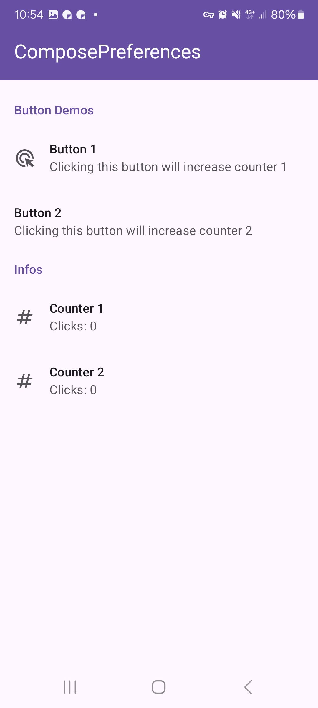
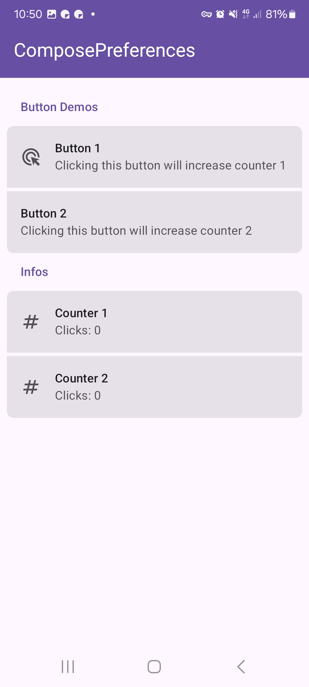

|                                                    |
|----------------------------------------------------|
|  |

This shows a simple button preference. It allows you to handle a click action.

Check out the composable and it's documentation in the code snipplet below.

#### Example

snippet: demo-button

#### Composable

snippet: PreferenceButton::constructor

#### Screenshots

|                                                         |                                                        |
|---------------------------------------------------------|--------------------------------------------------------|
|  |  |