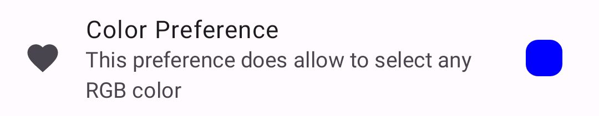
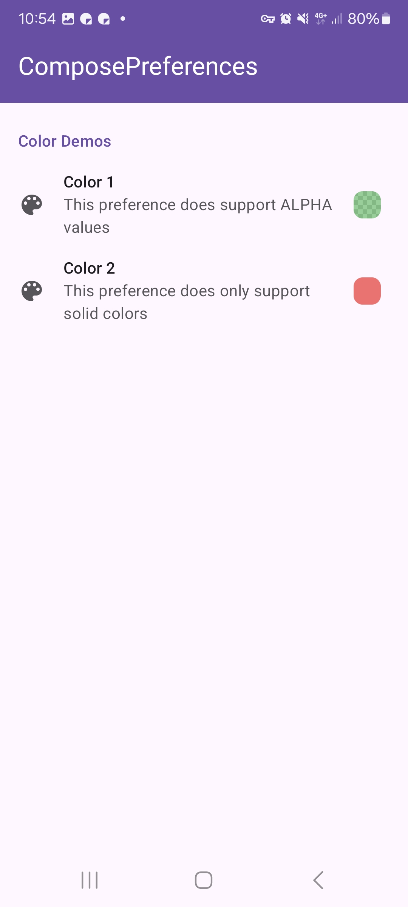
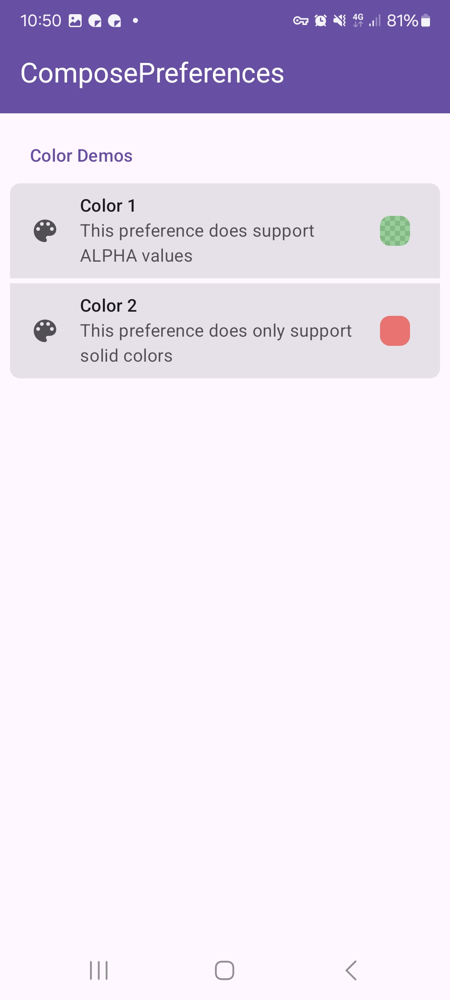
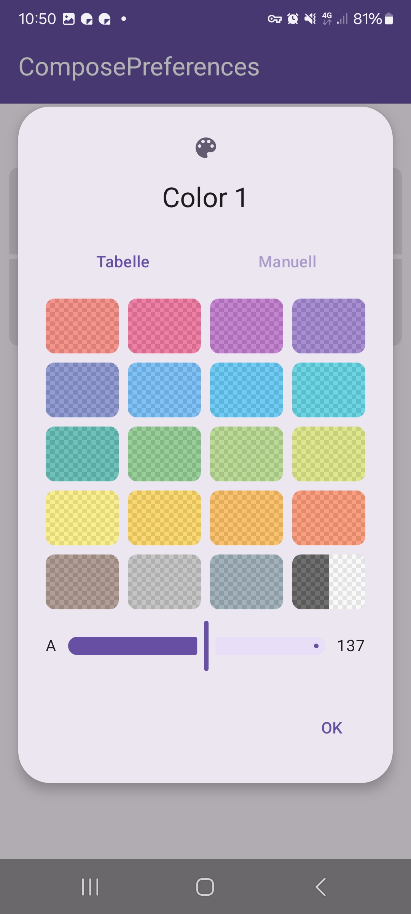
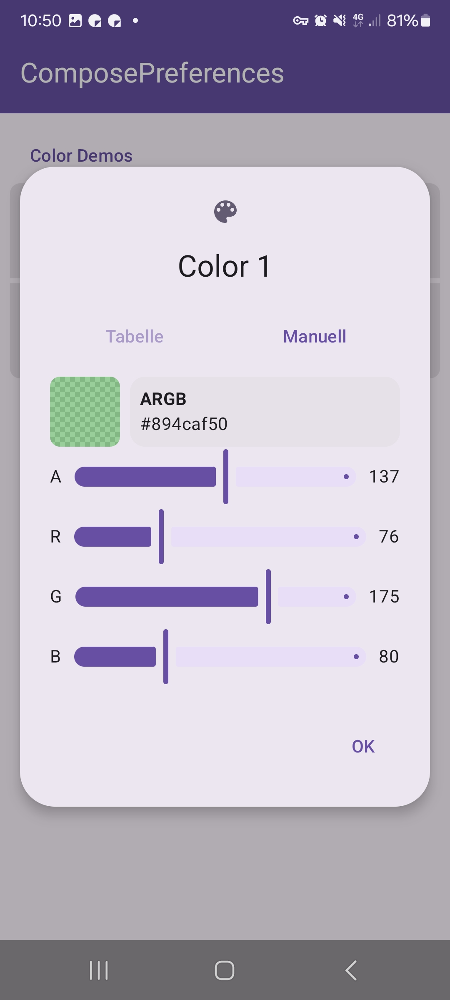

|                                                   |                                                   |
|---------------------------------------------------|---------------------------------------------------|
|  |  |

This shows a simple color picker preference.

Check out the composable and it's documentation in the code snipplet below.

#### Example

snippet: demo-color

#### Composable

##### Data as `MutableState`

snippet: PreferenceColor::constructor

##### Data as `value` + `onValueChange`

snippet: PreferenceColor::constructor2

#### Screenshots

|                                                       |                                                       |
|-------------------------------------------------------|-------------------------------------------------------|
|  |   |
|   |  |