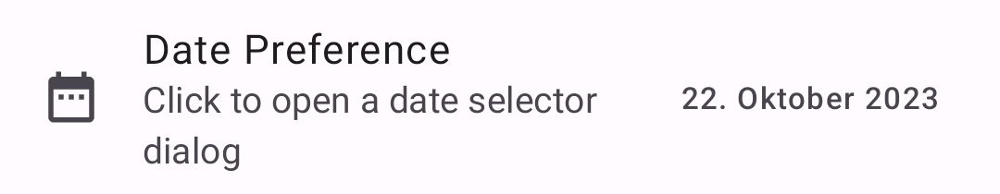
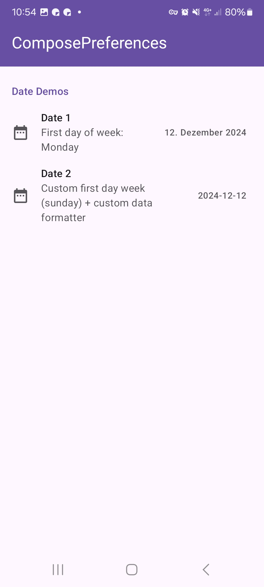
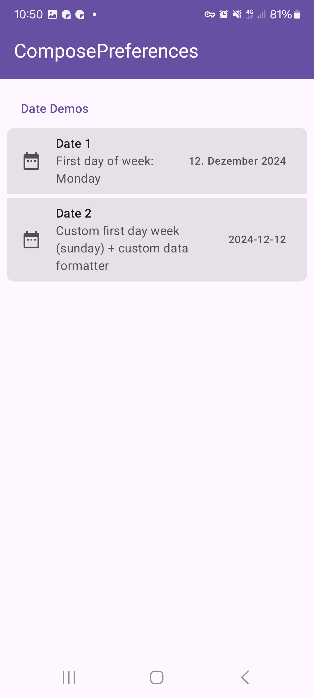
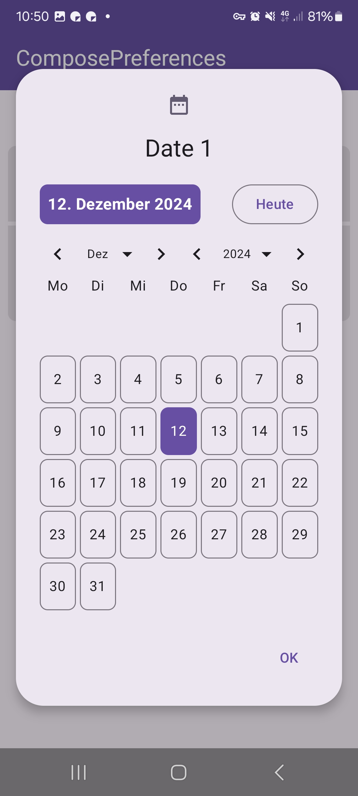

|                                                  |
|--------------------------------------------------|
|  |

This shows a simple date picker preference.

Check out the composable and it's documentation in the code snipplet below.

#### Example

<!-- snippet: demo-date -->
```kt
val now = DateTimeUtil.now().date
val date1 = dataStore.getLong("date1", now.toEpochDays())
    .collectAsState(initial = now.toEpochDays())
PreferenceDate(
    value = date1.value.let { LocalDate.fromEpochDays(it) },
    onValueChange = {
        scope.launch(DispatcherIO) {
            dataStore.update("date1", it.toEpochDays())
        }
    },
    title = "Date 1",
    subtitle = "First day of week: Monday",
    icon = { Icon(Icons.Default.DateRange, null) }
)
```
<!-- endSnippet -->

#### Composable

###### Data as `MutableState`

<!-- snippet: PreferenceDate::constructor -->
```kt
/**
 * A date preference item - this item provides a date dialog to change this preference
 *
 * &nbsp;
 *
 * **Basic Parameters:** all params not described here are derived from [com.michaelflisar.composepreferences.core.composables.BasePreference], check it out for more details
 *
 * @param value the [MutableState] of this item
 * @param firstDayOfWeek the first day of the week for the underlying date dialog
 * @param formatter the formatter for the selected date
 */
@Composable
fun PreferenceScope.PreferenceDate(
    // Special
    value: MutableState<LocalDate>,
    firstDayOfWeek: DayOfWeek = DayOfWeek.MONDAY,
    formatter: @Composable (date: LocalDate) -> String = {
        // comes from the ComposeDialog library
        defaultFormatterSelectedDate(it)
    },
    // Base Preference
    title: String,
    enabled: Dependency = Dependency.Enabled,
    visible: Dependency = Dependency.Enabled,
    subtitle: String? = null,
    icon: (@Composable () -> Unit)? = null,
    itemStyle: PreferenceItemStyle = LocalPreferenceSettings.current.style.defaultItemStyle,
    itemSetup: PreferenceItemSetup = PreferenceDateDefaults.itemSetup(),
    titleRenderer: @Composable (text: AnnotatedString) -> Unit = { Text(it) },
    subtitleRenderer: @Composable (text: AnnotatedString) -> Unit = { Text(it) },
    filterTags: List<String> = emptyList(),
    // Dialog
    dialog: @Composable (state: DialogState) -> Unit = { dialogState ->
        PreferenceDateDefaults.dialog(dialogState, value.value, { value.value = it }, firstDayOfWeek, formatter, title, icon)
    }
)
```
<!-- endSnippet -->

##### Data as `value` + `onValueChange`

<!-- snippet: PreferenceDate::constructor2 -->
```kt
/**
 * A date preference item - this item provides a date dialog to change this preference
 *
 * &nbsp;
 *
 * **Basic Parameters:** all params not described here are derived from [com.michaelflisar.composepreferences.core.composables.BasePreference], check it out for more details
 *
 * @param value the value of this item
 * @param onDateChange the value changed callback of this item
 * @param firstDayOfWeek the first day of the week for the underlying date dialog
 * @param formatter the formatter for the selected date
 */
@Composable
fun PreferenceScope.PreferenceDate(
    // Special
    value: LocalDate,
    onValueChange: (date: LocalDate) -> Unit,
    firstDayOfWeek: DayOfWeek = DayOfWeek.MONDAY,
    formatter: @Composable (date: LocalDate) -> String = {
        // comes from the ComposeDialog library
        defaultFormatterSelectedDate(it)
    },
    // Base Preference
    title: String,
    enabled: Dependency = Dependency.Enabled,
    visible: Dependency = Dependency.Enabled,
    subtitle: String? = null,
    icon: (@Composable () -> Unit)? = null,
    itemStyle: PreferenceItemStyle = LocalPreferenceSettings.current.style.defaultItemStyle,
    itemSetup: PreferenceItemSetup = PreferenceDateDefaults.itemSetup(),
    titleRenderer: @Composable (text: AnnotatedString) -> Unit = { Text(it) },
    subtitleRenderer: @Composable (text: AnnotatedString) -> Unit = { Text(it) },
    filterTags: List<String> = emptyList(),
    // Dialog
    dialog: @Composable (state: DialogState) -> Unit = { state ->
        PreferenceDateDefaults.dialog(state, value, onValueChange, firstDayOfWeek, formatter, title, icon)
    }
)
```
<!-- endSnippet -->

#### Screenshots

|                                                     |                                                    |
|-----------------------------------------------------|----------------------------------------------------|
|  |  |
|   |                                                    |
