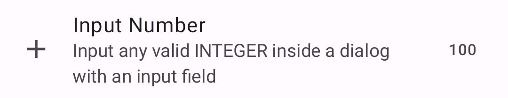
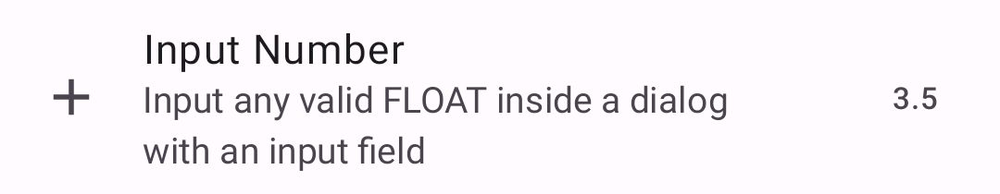

|                                                          |                                                         |
|----------------------------------------------------------|---------------------------------------------------------|
|    |  |
|  | |

This shows a simple input preference. It allows you to input a `string` or a `numeric` value.

Check out the composable and it's documentation in the code snipplet below.

#### Example

##### Text

snippet: demo-input

##### Numeric

snippet: demo-input2

#### Composable Text

##### Data as `MutableState`

snippet: PreferenceInputText::constructor

##### Data as `value` + `onValueChange`

snippet: PreferenceInputText::constructor2

#### Composable Numeric

##### Data as `MutableState`

snippet: PreferenceInputNumber::constructor

##### Data as `value` + `onValueChange`

snippet: PreferenceInputNumber::constructor2

#### Screenshots

|                                                       |                                                      |
|-------------------------------------------------------|------------------------------------------------------|
|  |  |
|   |                                                      |