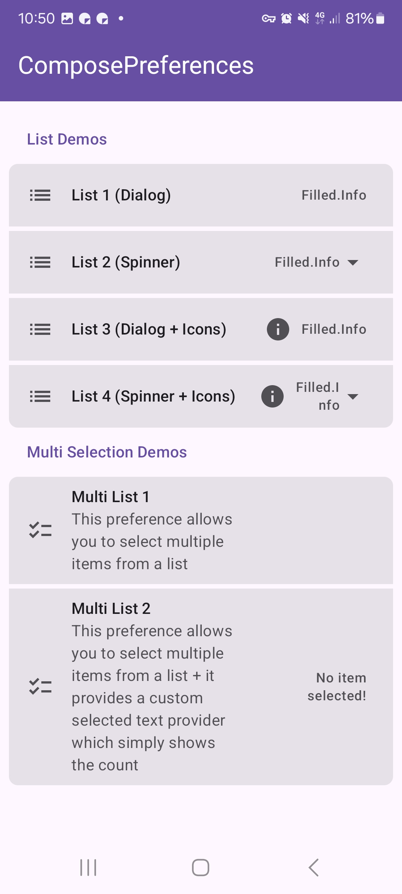

|                                                  |                                                  |
|--------------------------------------------------|--------------------------------------------------|
|  |  |

This shows a simple list preference. It allows to select one or multiple items from a list.

Check out the composable and it's documentation in the code snipplet below.

#### Example

##### Single Selection

snippet: demo-list

##### Multi Selection

snippet: demo-list2

#### Composable - Single Selection List

##### Data as `MutableState`

snippet: PreferenceList::constructor

##### Data as `value` + `onValueChange`

snippet: PreferenceList::constructor2

#### Composable - Multi Selection List

##### Data as `MutableState`

snippet: PreferenceListMulti::constructor

##### Data as `value` + `onValueChange`

snippet: PreferenceListMulti::constructor2

#### Screenshots

|                                                      |                                                     |
|------------------------------------------------------|-----------------------------------------------------|
|   |   |
|    |  |
|  |                                                     |