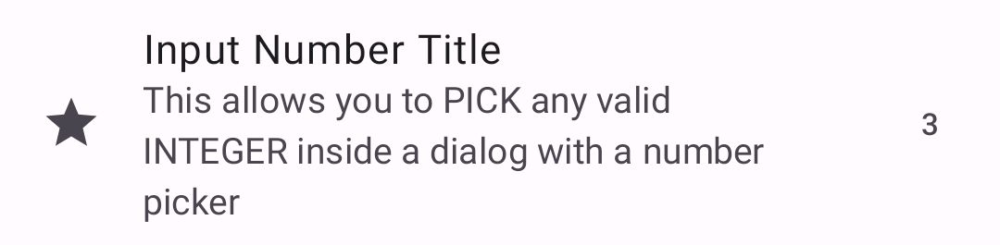
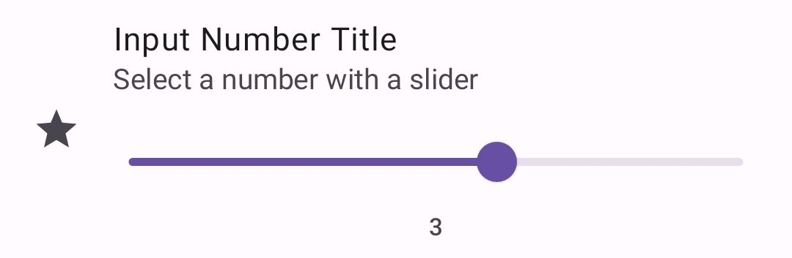

|                                                    |                                                    |
|----------------------------------------------------|----------------------------------------------------|
|  |  |

This shows a simple number picker preference.

Check out the composable and it's documentation in the code snipplet below.

#### Example

snippet: demo-number

#### Composable

##### Data as `MutableState`

snippet: PreferenceNumber::constructor

##### Data as `value` + `onValueChange`

snippet: PreferenceNumber::constructor2

#### Screenshots

|                                                         |                                                        |
|---------------------------------------------------------|--------------------------------------------------------|
|  |  |
|   |                                                        |