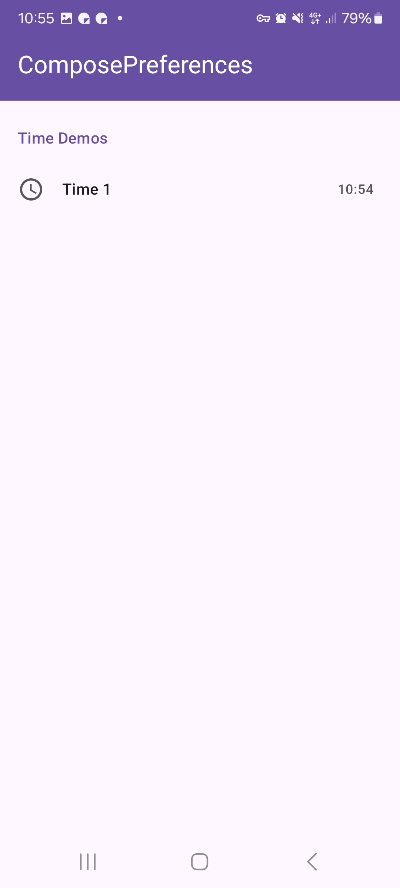

|                                                  |
|--------------------------------------------------|
|  | 

This shows a simple timeean preference. It allows to toggle a timeean value.

Check out the composable and it's documentation in the code snipplet below.

#### Example

<!-- snippet: demo-time -->
```kt
val now = DateTimeUtil.now().time
val time1 = dataStore.getInt("time1", now.toSecondOfDay())
    .collectAsState(initial = now.toSecondOfDay())
PreferenceTime(
    value = time1.value.let {
        LocalTime.fromSecondOfDay(it)
    },
    onValueChange = {
        scope.launch(DispatcherIO) {
            dataStore.update("time1", it.toSecondOfDay())
        }
    },
    title = "Time 1",
    icon = { Icon(Icons.Default.AccessTime, null) }
)
```
<!-- endSnippet -->

#### Composable

##### Data as `MutableState`

<!-- snippet: PreferenceTime::constructor -->
```kt
/**
 * A color preference item - this item provides a time picker dialog to change this preference
 *
 * &nbsp;
 *
 * **Basic Parameters:** all params not described here are derived from [com.michaelflisar.composepreferences.core.composables.BasePreference], check it out for more details
 *
 * @param value the [MutableState] of this item
 * @param is24Hours if true, the time picker shows a picker in 24h mode, otherwise it will use the 12h mode
 * @param formatter the formatter to format the time
 */
@Composable
fun PreferenceScope.PreferenceTime(
    // Special
    value: MutableState<LocalTime>,
    is24Hours: Boolean = is24HourFormat(), // comes from ComposeDialog
    formatter: @Composable (time: LocalTime) -> String = { defaultTimeFormat(is24Hours, it) },
    // Base Preference
    title: String,
    enabled: Dependency = Dependency.Enabled,
    visible: Dependency = Dependency.Enabled,
    subtitle: String? = null,
    icon: (@Composable () -> Unit)? = null,
    itemStyle: PreferenceItemStyle = LocalPreferenceSettings.current.style.defaultItemStyle,
    itemSetup: PreferenceItemSetup = PreferenceTimeDefaults.itemSetup(),
    titleRenderer: @Composable (text: AnnotatedString) -> Unit = { Text(it) },
    subtitleRenderer: @Composable (text: AnnotatedString) -> Unit = { Text(it) },
    filterTags: List<String> = emptyList(),
    // Dialog
    dialog: @Composable (state: DialogState) -> Unit = { dialogState ->
        PreferenceTimeDefaults.dialog(
            dialogState,
            value.value,
            { value.value = it },
            is24Hours,
            title,
            icon
        )
    },
)
```
<!-- endSnippet -->

##### Data as `value` + `onValueChange`

<!-- snippet: PreferenceTime::constructor2 -->
```kt
/**
 * A color preference item - this item provides a time picker dialog to change this preference
 *
 * &nbsp;
 *
 * **Basic Parameters:** all params not described here are derived from [com.michaelflisar.composepreferences.core.composables.BasePreference], check it out for more details
 *
 * @param value the value of this item
 * @param onValueChange the value changed callback of this item
 * @param is24Hours if true, the time picker shows a picker in 24h mode, otherwise it will use the 12h mode
 * @param formatter the formatter to format the time
 */
@Composable
fun PreferenceScope.PreferenceTime(
    // Special
    value: LocalTime,
    onValueChange: (value: LocalTime) -> Unit,
    is24Hours: Boolean = is24HourFormat(), // comes from ComposeDialog
    formatter: @Composable (time: LocalTime) -> String = { defaultTimeFormat(is24Hours, it) },
    // Base Preference
    title: String,
    enabled: Dependency = Dependency.Enabled,
    visible: Dependency = Dependency.Enabled,
    subtitle: String? = null,
    icon: (@Composable () -> Unit)? = null,
    itemStyle: PreferenceItemStyle = LocalPreferenceSettings.current.style.defaultItemStyle,
    itemSetup: PreferenceItemSetup = PreferenceTimeDefaults.itemSetup(),
    titleRenderer: @Composable (text: AnnotatedString) -> Unit = { Text(it) },
    subtitleRenderer: @Composable (text: AnnotatedString) -> Unit = { Text(it) },
    filterTags: List<String> = emptyList(),
    // Dialog
    dialog: @Composable (state: DialogState) -> Unit = { dialogState ->
        PreferenceTimeDefaults.dialog(dialogState, value, onValueChange, is24Hours, title, icon)
    },
)
```
<!-- endSnippet -->

#### Screenshots

|                                                     |                                                    |
|-----------------------------------------------------|----------------------------------------------------|
|  |  |
|   |                                                    |
