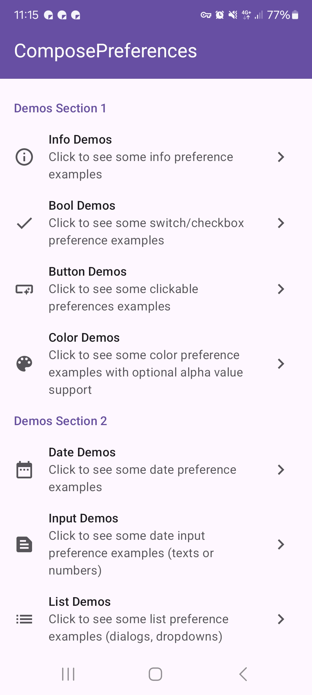
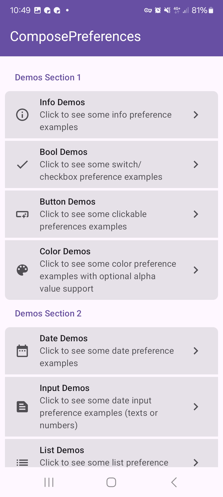

You can apply two predefined styles with a log of customisations on top of it. `Default` and `Modern`. The *modern style* does group sections and also applies custom edges to the groups whereas the *default style* is a flat and more simply style.

Additionally you can customise how texts are rendered as well as how the preferences are styled. Check out following for more details.

All those customisations are supported by *all* preference composables.

## PreferenceStyle

| Default                                             | Modern                                             |
|-----------------------------------------------------|----------------------------------------------------|
|  |  |

=== "Default"

    ```kotlin
    --8<-- "../../library/core/src/commonMain/kotlin/com/michaelflisar/composepreferences/core/styles/DefaultStyle.kt:create"
    ```

=== "Modern"

    ```kotlin
    --8<-- "../../library/core/src/commonMain/kotlin/com/michaelflisar/composepreferences/core/styles/ModernStyle.kt:create"
    ```

## Other Styling Options

#### ItemStyle

You can find some `composable` functions inside `PreferenceStyleDefaults` that allow you to create a `PreferenceItemStyle` instance.

Those functions allow you to change colors, paddings, shapes, text styles and similar.

Following is one of those functions.

```kotlin
--8<-- "../../library/core/src/commonMain/kotlin/com/michaelflisar/composepreferences/core/styles/PreferenceStyleDefaults.kt:item"
```

#### Text Styling

By default you already adjust the styles via the `ItemStyle` (`titleTextStyle` + `subtitleTextStyle`) . However, you can also adjust the text styling by providing custom `titleRenderer` and `subtitleRenderer` to all preferences.

Those do provide an `AnnotatedString` that you can render as you like. Be awere, that this string has already applied the filter highlighting if you use filtering.

The default renderer for all preferences look like following (they use a simple `Text` composable, the correct text styles from your `ItemStyle` are provided by `CompositionLocal` already):

```kotlin
titleRenderer: @Composable (text: AnnotatedString) -> Unit = { Text(it) },
subtitleRenderer: @Composable (text: AnnotatedString) -> Unit = { Text(it) }
```

#### PreferenceItemSetup

You can find some `composable` functions inside `Preference*Defaults` that allow you to create a `PreferenceItemSetup` instance. All preference types to provide their own default setup.

This is some special class, it's used to internally setup a preference item and to provide user customisations. It's public because of the extendibility of this library.

Whenever you want to customise something you should do it like following:

```koltin
val setup = Preference*Defaults.itemSetup().copy(
    // ... only customise what you want to change
)
```

Here's the class that shows you what can be customised:

```kotlin
--8<-- "../../library/core/src/commonMain/kotlin/com/michaelflisar/composepreferences/core/composables/PreferenceItem.kt:constructor"
```
