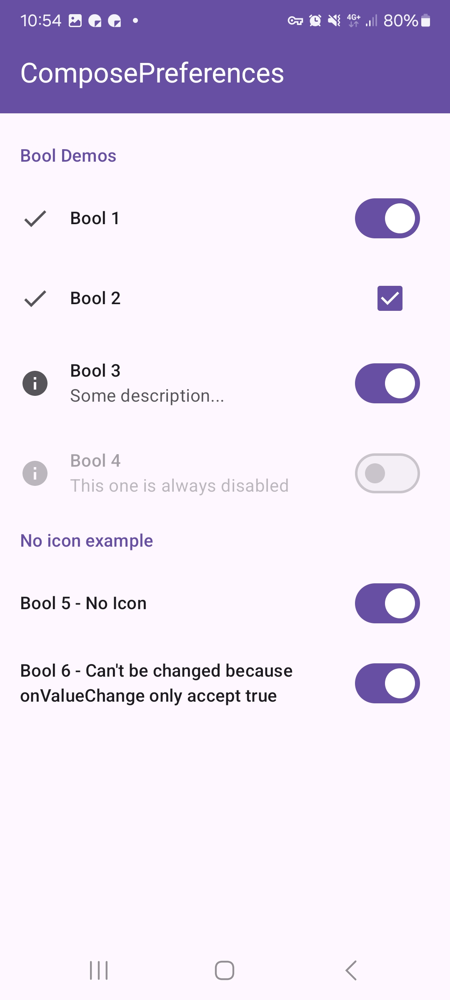
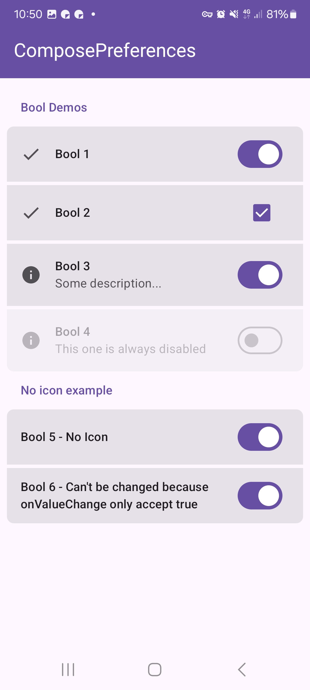

|                                                  |                                                  |
|--------------------------------------------------|--------------------------------------------------|
|  |  |

This shows a simple boolean preference. It allows to toggle a boolean value.

Check out the composable and it's documentation in the code snipplet below.

#### Example

```kotlin
--8<-- "../../demo/android/src/main/java/com/michaelflisar/composepreferences/demo/demos/PrefScreenDemo.kt:demo-bool"
```

#### Composable

=== "Data as `MutableState`"

    ```kotlin
    --8<-- "../../library/modules/screen/bool/src/commonMain/kotlin/com/michaelflisar/composepreferences/screen/bool/PreferenceBool.kt:constructor"
    ```

=== "Data as `value` + `onValueChange`"

    ```kotlin
    --8<-- "../../library/modules/screen/bool/src/commonMain/kotlin/com/michaelflisar/composepreferences/screen/bool/PreferenceBool.kt:constructor2"
    ```

#### Screenshots

|                                                     |                                                    |
|-----------------------------------------------------|----------------------------------------------------|
|  |  |