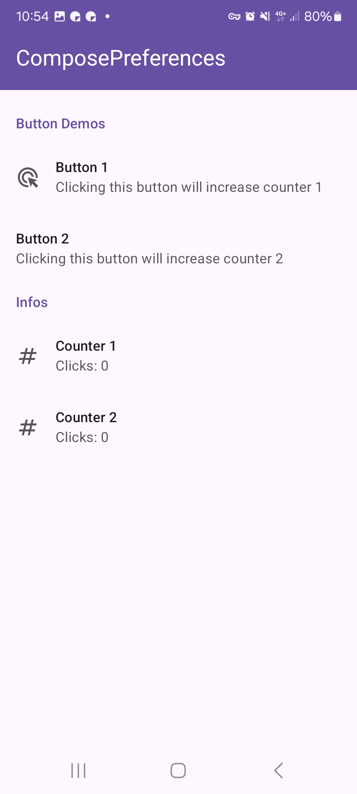
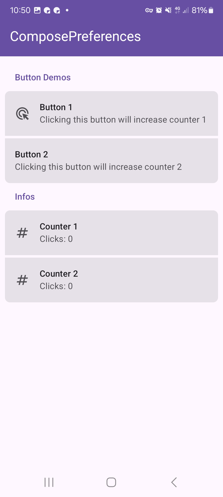

|                                                    |
|----------------------------------------------------|
|  |

This shows a simple button preference. It allows you to handle a click action.

Check out the composable and it's documentation in the code snipplet below.

#### Example

```kotlin
--8<-- "../../demo/android/src/main/java/com/michaelflisar/composepreferences/demo/demos/PrefScreenDemo.kt:demo-button"
```

#### Composable

```kotlin
--8<-- "../../library/modules/screen/button/src/commonMain/kotlin/com/michaelflisar/composepreferences/screen/button/PreferenceButton.kt:constructor"
```

#### Screenshots

|                                                         |                                                        |
|---------------------------------------------------------|--------------------------------------------------------|
|  |  |