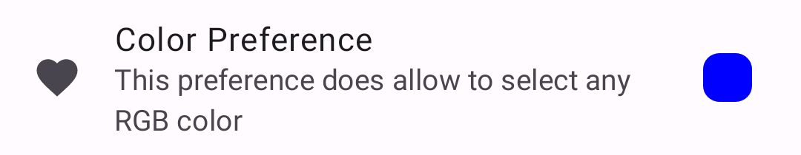
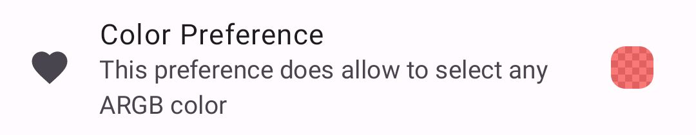
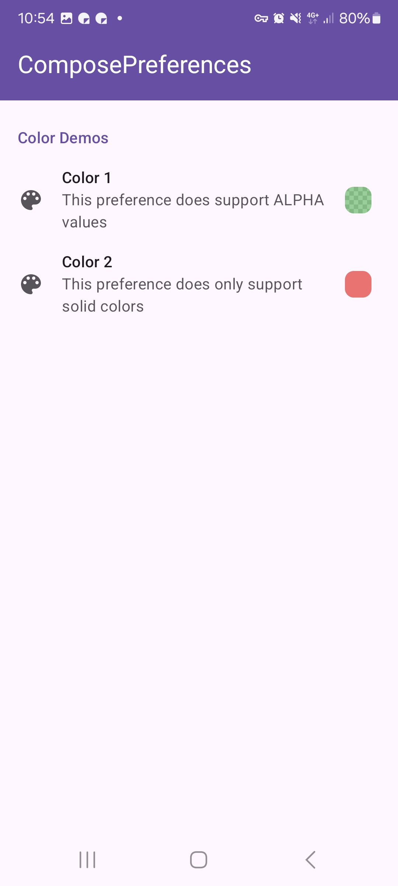
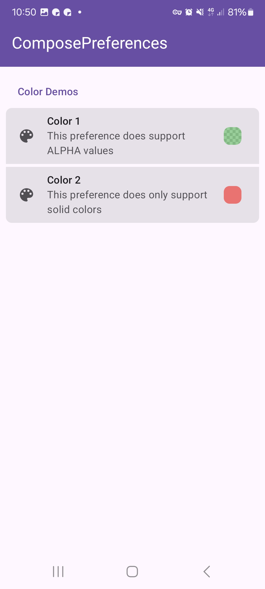
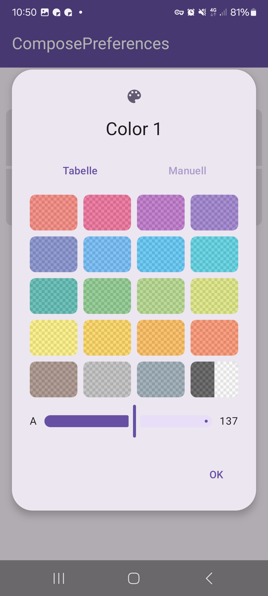
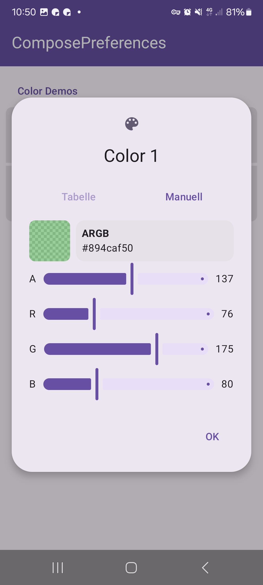

|                                                   |                                                   |
|---------------------------------------------------|---------------------------------------------------|
|  |  |

This shows a simple color picker preference.

Check out the composable and it's documentation in the code snipplet below.

#### Example

```kotlin
--8<-- "../../demo/app/android/src/main/java/com/michaelflisar/composepreferences/demo/demos/PrefScreenDemo.kt:demo-color"
```

#### Composable

=== "Data as `MutableState`"

    ```kotlin
    --8<-- "../../library/modules/screen/color/src/commonMain/kotlin/com/michaelflisar/composepreferences/screen/color/PreferenceColor.kt:constructor"
    ```

=== "Data as `value` + `onValueChange`"

    ```kotlin
    --8<-- "../../library/modules/screen/color/src/commonMain/kotlin/com/michaelflisar/composepreferences/screen/color/PreferenceColor.kt:constructor2"
    ```

#### Screenshots

|                                                       |                                                       |
|-------------------------------------------------------|-------------------------------------------------------|
|  |   |
|   |  |