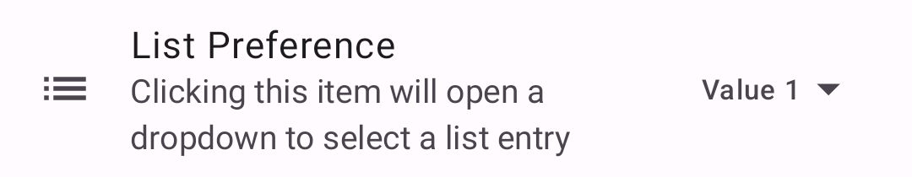
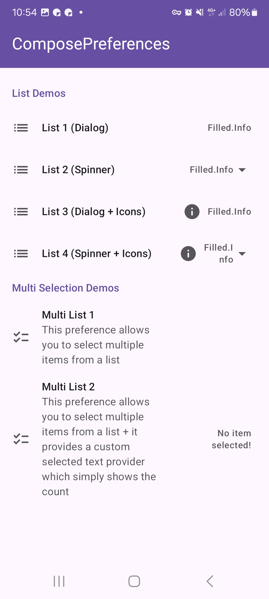
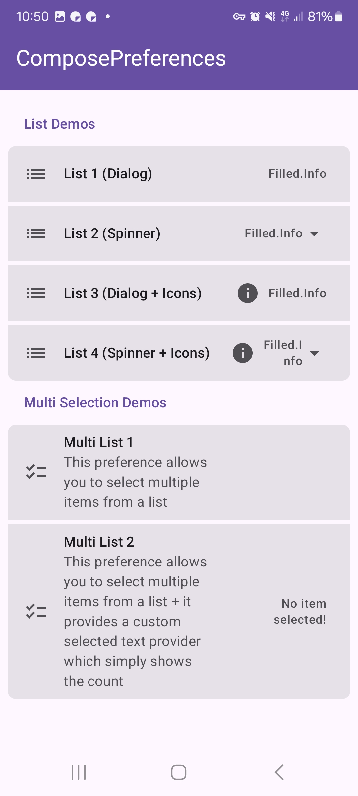
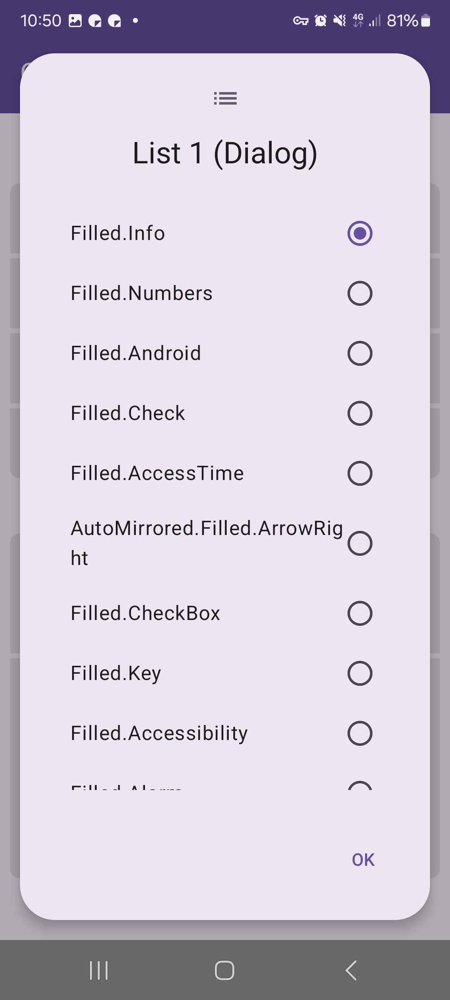
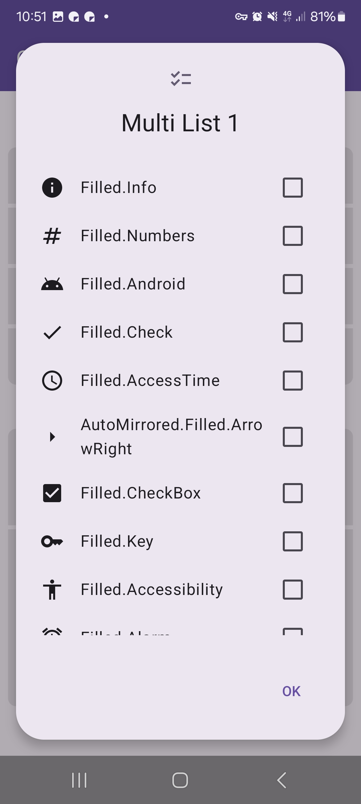
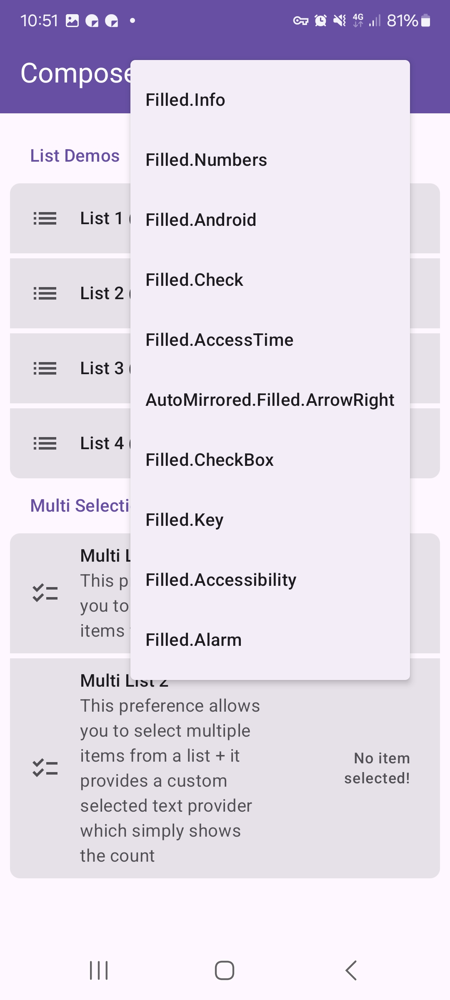

|                                                  |                                                  |
|--------------------------------------------------|--------------------------------------------------|
|  |  |

This shows a simple list preference. It allows to select one or multiple items from a list.

Check out the composable and it's documentation in the code snipplet below.

#### Example

=== "Single Selection"

    ```kotlin
    --8<-- "../demo/android/src/main/java/com/michaelflisar/composepreferences/demo/demos/PrefScreenDemo.kt:demo-list"
    ```

=== "Multi Selection"

    ```kotlin
    --8<-- "../demo/android/src/main/java/com/michaelflisar/composepreferences/demo/demos/PrefScreenDemo.kt:demo-list2"
    ```

#### Composable - Single Selection List

=== "Data as `MutableState`"

    ```kotlin
    --8<-- "../../library/modules/screen/list/src/commonMain/kotlin/com/michaelflisar/composepreferences/screen/list/PreferenceList.kt:constructor"
    ```

=== "Data as `value` + `onValueChange`"

    ```kotlin
    --8<-- "../../library/modules/screen/list/src/commonMain/kotlin/com/michaelflisar/composepreferences/screen/list/PreferenceList.kt:constructor2"
    ```

#### Composable - Multi Selection List

=== "Data as `MutableState`"

    ```kotlin
    --8<-- "../../library/modules/screen/list/src/commonMain/kotlin/com/michaelflisar/composepreferences/screen/list/PreferenceListMulti.kt:constructor"
    ```

=== "Data as `value` + `onValueChange`"

    ```kotlin
    --8<-- "../../library/modules/screen/list/src/commonMain/kotlin/com/michaelflisar/composepreferences/screen/list/PreferenceListMulti.kt:constructor2"
    ```

#### Screenshots

|                                                      |                                                     |
|------------------------------------------------------|-----------------------------------------------------|
|   |   |
|    |  |
|  |  |