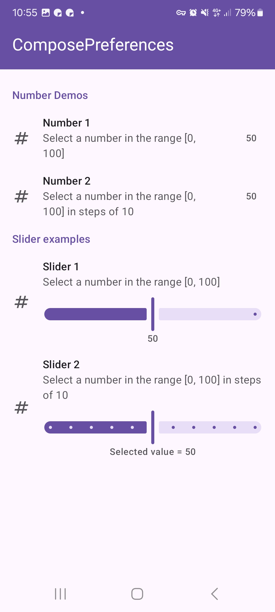
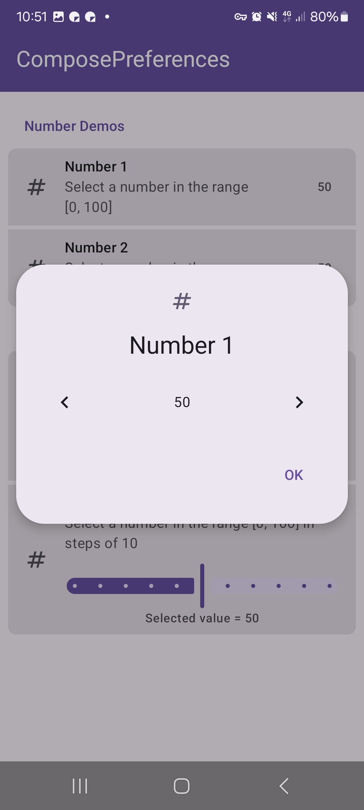

|                                                    |                                                    |
|----------------------------------------------------|----------------------------------------------------|
|  |  |

This shows a simple number picker preference.

Check out the composable and it's documentation in the code snipplet below.

#### Example

```kotlin
--8<-- "../../demo/android/src/main/java/com/michaelflisar/composepreferences/demo/demos/PrefScreenDemo.kt:demo-number"
```

#### Composable

=== "Data as `MutableState`"

    ```kotlin
    --8<-- "../../library/modules/screen/number/src/commonMain/kotlin/com/michaelflisar/composepreferences/screen/number/PreferenceNumber.kt:constructor"
    ```

=== "Data as `value` + `onValueChange`"

    ```kotlin
    --8<-- "../../library/modules/screen/number/src/commonMain/kotlin/com/michaelflisar/composepreferences/screen/number/PreferenceNumber.kt:constructor2"
    ```

#### Screenshots

|                                                         |                                                        |
|---------------------------------------------------------|--------------------------------------------------------|
|  |  |
|   |                                                        |