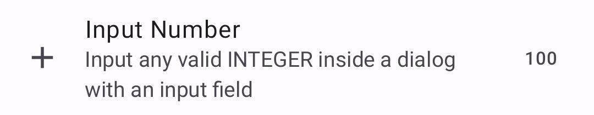
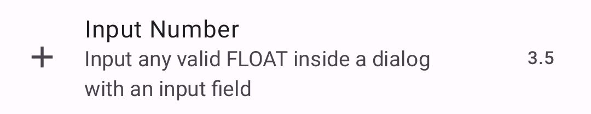
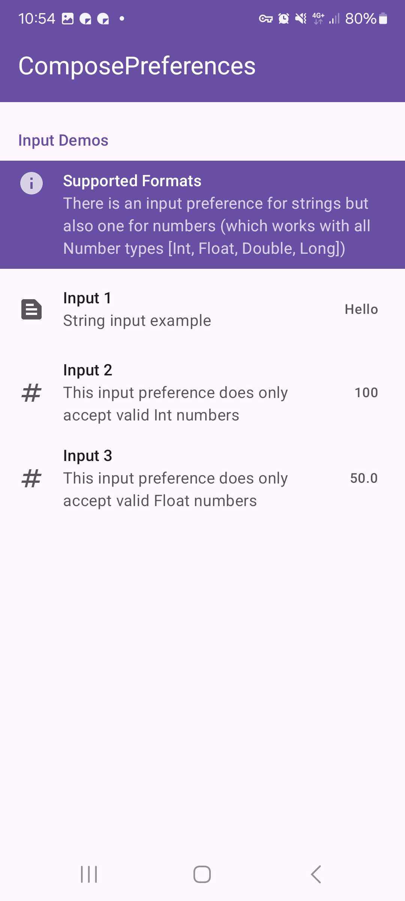
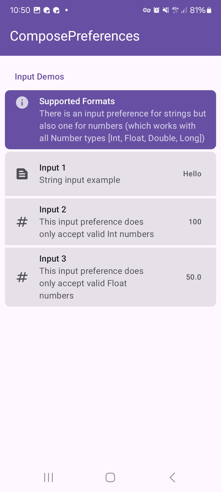
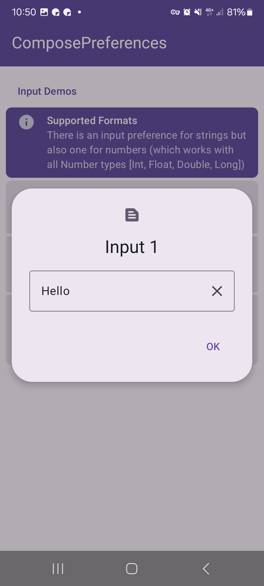

|                                                          |                                                         |
|----------------------------------------------------------|---------------------------------------------------------|
|    |  |
|  | |

This shows a simple input preference. It allows you to input a `string` or a `numeric` value.

Check out the composable and it's documentation in the code snipplet below.

#### Example

=== "Text"

    ```kotlin
    --8<-- "../demo/android/src/main/java/com/michaelflisar/composepreferences/demo/demos/PrefScreenDemo.kt:demo-input"
    ```

=== "Numeric"

    ```kotlin
    --8<-- "../demo/android/src/main/java/com/michaelflisar/composepreferences/demo/demos/PrefScreenDemo.kt:demo-input2"
    ```

#### Composable Text

=== "Data as `MutableState`"

    ```kotlin
    --8<-- "../library/modules/screen/input/src/commonMain/kotlin/com/michaelflisar/composepreferences/screen/input/PreferenceInputText.kt:constructor"
    ```

=== "Data as `value` + `onValueChange`"

    ```kotlin
    --8<-- "../library/modules/screen/input/src/commonMain/kotlin/com/michaelflisar/composepreferences/screen/input/PreferenceInputText.kt:constructor2"
    ```

#### Composable Numeric

=== "Data as `MutableState`"

    ```kotlin
    --8<-- "../library/modules/screen/input/src/commonMain/kotlin/com/michaelflisar/composepreferences/screen/input/PreferenceInputNumber.kt:constructor"
    ```

=== "Data as `value` + `onValueChange`"

    ```kotlin
    --8<-- "../library/modules/screen/input/src/commonMain/kotlin/com/michaelflisar/composepreferences/screen/input/PreferenceInputNumber.kt:constructor2"
    ```

#### Screenshots

|                                                       |                                                      |
|-------------------------------------------------------|------------------------------------------------------|
|  |  |
|   | |